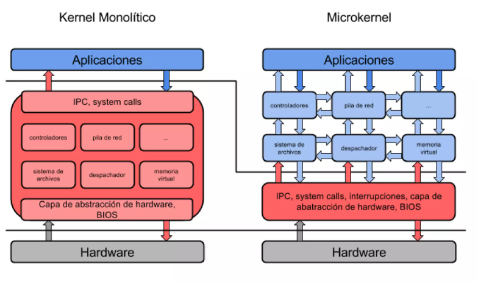
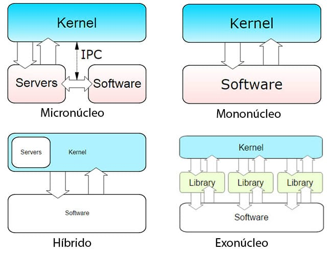

# Kernel

Un kernel, o mejor conocido como un núcleo, específicamente en la rama de la informática, no es que más que un software especial que forma parte importante del sistema operativo de cualquier ordenador. Por lo general, cuenta con la característica de que el mismo se ejecuta en un modo privilegiado, también llamado y mejor conocido como modo núcleo. Dentro de sus principales funciones, está el hecho de que facilita cualquier programa principal y necesario en el hardware del ordenador y es el encargado de gestionar cada uno de ellos para que funcionen de forma correcta.

## Funciones del kernel

Como bien sabemos todos, existen distintos programas cuyo acceso es bastante limitado en cuanto al hardware se refiere, pero para eso existen los núcleos: para gestionar cada uno de esos programas y decidir cuál, y cuánto tiempo, va a funcionar el mismo en el ordenador.

El kernel no cumple sólo con las funciones antes descritas, sino que es bastante funcional y permite diversas acciones, como el hecho de que los mismos cumplen con una serie de pasos (abstracciones) que permiten que el sistema cuente con una interfaz segura y limpia. Por otro lado, es importante resaltar que en distintos sistemas no existe ningún tipo de núcleo, lo cual resalta el hecho de que no son completamente necesarios, pero sí importantes.

Para resaltar las funciones más importantes de un kernel, a continuación se los enumeramos:

- Administran la memoria de cada uno de los programas que gestiona y mantiene bajo control todos esos procesos que están en ejecución.
- Además, cumplen con el objetivo de que administrar todos los procesos que se están ejecutando de forma actual.
- Por otro lado, cumplen la función de gestionar todos los programas informáticos con los que cuenta un ordenador.
- Gestion del hardware (memoria, procesador perifericos)

Como decíamos con anterioridad, el ordenador no necesariamente exige de un kernel para funcionar como debe ser. Esto se debe a que todos los programas se cargan y ejecutan sin necesidad precisa de un núcleo que dicte su funcionamiento. Antes, los núcleos eran prácticamente obsoletos, por no decir innecesarios, ya que para que todo vuelva a funcionar como debe ser, el ordenador debía reiniciarse y reconfigurarse a cada momento para que sus programas se restablezcan. Sin embargo, con el tiempo los desarrolladores se dieron cuenta de que se necesitaba un refuerzo y cambiar de estrategia ya que la misma estaba empezando a pasar factura, por lo que se empezó poco a poco a incluir en los ordenadores, diversos sistemas y memorias para que todo quede establecido en ellas. Los programas que se creaban son catalogados como programas auxiliares, entre los cuales destacan el cargador y el depurador. Una vez que estos programas iban aumentando en número, se consideraron necesarios y se catalogaron como núcleos, siendo estos los primeros en ser creados.

De este modo se llegó a la conclusión de que los ordenadores necesitaban de un kernel de forma obligatoria para que el funcionamiento del ordenador se produzca de forma correcta. Sin embargo, se sigue sosteniendo la teoría de que no son del todo obligatorios y de que un ordenador puede seguir funcionando sin un núcleo.

Gracias a esto, se crearon diversos tipos de kernel en donde cada uno de ellos funciona a su manera y cumple diferentes características, por medio de las cuales se pueden diferenciar cuatro de ellos.

## Tipos de Kernel

- ### Kernel monolítico

    Este tipo de núcleo es aquel que facilita la abstracción del hardware subyacente sin importar su grado de potencia o variedad. Para realizar una comparación objetiva, estos núcleos son bastante complejos en cuanto a su manejo, siendo comparados con los próximos que vamos a observar. Hace más de veinte años, estos núcleos eran los principales en ser catalogados como obsoletos e inservibles, además de innecesarios. Sin embargo, con el tiempo han sido catalogados como mejorados e importantes, aunque no precisamente los mejores.

- ### Microkernel

    Mejor conocidos como micronúcleos, estos son aquellos que son catalogados como mejores en comparación con el kernel anterior, debido a que el mismo cumple una serie de pequeñas abstracciones mucho más simples que las comúnmente observadas en el kernel monolítico, y su función principal es utilizar diversas aplicaciones para facilitar su funcionalidad. Su verdadero objetivo principal, es el de implementar estos servicios de forma separada en cuanto a la política de funcionamiento del sistema, se refiere. De este modo se busca que el núcleo funcione de maravilla y sea bastante simple y organizado de utilizar.

    

- ### Núcleos híbridos

    Este tipo de kernel, es aquel que se considera una gran modificación del microkernel, que si bien son bastante similares en cuanto a diversas características, se diferencian debido a que este cuenta con un espacio adicional que cumple la función de permitir que el mismo se ejecute de forma mucho más rápida y funcional. Sin embargo, cualquiera de estos dos núcleos es bastante funcional, incluso los micronúcleos comunes, los cuales tienen un excelente rendimiento. Muchos de los sistemas operativos que se aplican hoy en día, cuentan con estos dos tipos de núcleos ya que ambos funcionan muy bien.

- ### Exonúcleos

    Y por último, tenemos los Exonúcleos, los cuales son aquellos que si bien no cuentan con ningún tipo de abstracción, son aquellos que permiten el uso de bibliotecas. Dicho de otro modo, son núcleos que funcionan de maravilla al momento de ofrecer mucha funcionalidad, gracias a que los mismos cuentan con un acceso directo al hardware del sistema. Esto quiere decir, que gracias a esta gran característica, el desarrollador podrá ser capaz de permitir todas esas decisiones importantes en cuanto al rendimiento del sistema se refiere. Además, se caracterizan gracias a que son muy pequeños y a que esto realmente no limita su gran funcionamiento. Sin embargo, se sigue prefiriendo el uso de los dos kernel anteriores para los diversos sistemas que se utilizan hoy en día.

    

## __Diferencias entre Kernel Monolitico y Microkernel__

1. __Uso de espacio para la ejecucion:__ 
    - El nucleo monolitico ejecuta todas las instrucciones del sistema operativo el mismo espacio de direcciones que es el espacio del núcleo
    - el microkernel ejecuta la mayoría de las instrucciones del sistema en el espacio del usuario y solo unas pocas en el espacio del núcleo. En el caso de los microkernels, solo los procesos importantes, como la comunicación entre procesos, la programación y la gestión de la memoria, tienen lugar en el espacio del kernel.

2. __Tamaño del nucleo:__
    - en monolitico, dado que todas las instrucciones del sistema se ejecutan en el espacio del núcleo, aumenta el tamaño general del núcleo. Esto lleva a un aumento en el tamaño del sistema operativo también.
    - el microkernel es mas pequeño con respecto al monolitico

3. __Velocidad de ejecucion:__
    - el kernel monolítico proporciona una mejor velocidad en comparación con Microkernel, ya que ejecuta todas las instrucciones en el mismo espacio de direcciones, lo que hace que la ejecución sea más rápida.
    - En el caso de Microkernel, la ejecución es más lenta debido a los mensajes adicionales que pasan entre los diferentes servicios que se ejecutan en diferentes espacios de direcciones.

4. __Estabilidad:__
    - si un proceso se bloquea en un núcleo monolítico, se produce una interrupción en todo el sistema. Esto se debe a que cada proceso que se ejecuta en el mismo espacio de direcciones se ve afectado. 
    - Mientras que en el caso del microkernel debido a la división de la operación del sistema entre el kernel y el espacio de usuario, un bloqueo del servicio no afecta a otros servicios.

5. __Comunicación entre procesos :__
    - los núcleos monolíticos utilizan señales y zócalos para lograr la comunicación entre procesos- 
    - mientras que los micro núcleos utilizan colas de mensajes para lograr lo mismo.

    
6. __Extensibilidad:__ 
    - una de las principales diferencias entre los dos tipos de kernel es la extensibilidad. Para agregar nuevas características a un núcleo monolítico, uno tendría que volver a compilar todo el núcleo. La recompilación llevaría a más memoria y consumo de tiempo. 
    - Por otro lado, en el caso del microkernel, los servicios están aislados unos de otros a medida que implementa colas de mensajería, lo que hace que sea más flexible agregar o eliminar funciones.

7. __Mantenibilidad:__
    - Esto es similar a la extensibilidad. Para corregir cualquier error en el núcleo monolítico, uno tendría que volver a compilar todo el núcleo. 
    - en el caso del microkernel todo lo mensionado anteriormente no sucede

8. __Depuración:__
    - un bloqueo en el modo privilegiado que es el espacio del kernel podría dañar el depurador. Debido a esto, es difícil depurar un núcleo monolítico.
    - en comparación el microkernel es mas facil depurar.

9. __Seguridad:__
    - el kernel monolítico ejecuta todo su código en modo privilegiado, lo que aumenta las posibilidades de un desastre.
    - los microkernels son más seguros en comparación con el kernel monolítico.

Como ejemplos de kernel monolitico tenemos Linux, mientras que Mac Os es considerado como un microkernel, asi tambien Windows es considerado como un kernel de nucleos hibridos.