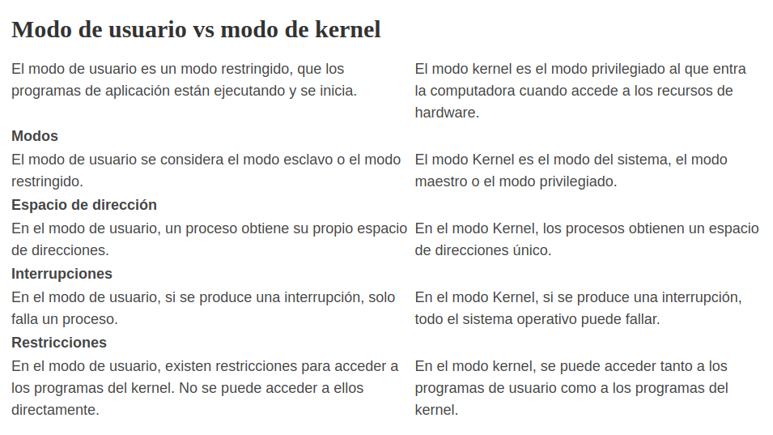

# Modo Usuario vs Modo Kernel

Una computadora funciona en dos modos que son el modo de usuario y el modo de kernel. Cuando la computadora está ejecutando software de aplicación, está en modo de usuario. Después de que el software de la aplicación solicite el hardware, la computadora ingresa al modo kernel. El núcleo es el núcleo del sistema informático. Posteriormente, la computadora cambia con frecuencia entre el modo de usuario y el modo de kernel. La mayoría de las tareas críticas del sistema operativo se ejecutan en modo kernel. los diferencia clave entre el modo de usuario y el modo kernel es que el modo de usuario es el modo en el que se ejecutan las aplicaciones y el modo de kernel es el modo privilegiado al que entra la computadora cuando accede a los recursos de hardware.

## Modo Usuario

Cuando se ejecuta una aplicación informática, está en modo de usuario. Algunos ejemplos son la aplicación de Word, PowerPoint, leer un archivo PDF y navegar por Internet. Estos son programas de aplicación, por lo que la computadora está en modo de usuario. Cuando el proceso está en modo de usuario y requiere algún recurso de hardware, esa solicitud se envía al kernel. Como hay un acceso limitado al hardware en este modo, se conoce como modo menos privilegiado, modo esclavo o modo restringido.

En el modo de usuario, los procesos obtienen su propio espacio de direcciones y no pueden acceder al espacio de direcciones que pertenece al kernel. Entonces, la falla de un proceso no afectará al sistema operativo. Si hay una interrupción, solo afecta a ese proceso en particular.

## Modo Kernel

Un kernel es un programa de software que se utiliza para acceder a los componentes de hardware de un sistema informático. Kernel funciona como software intermedio para hardware y software de aplicación / programas de usuario. El modo Kernel generalmente está reservado para funciones confiables de bajo nivel del sistema operativo.

Cuando el proceso se está ejecutando en modo de usuario y si ese proceso requiere recursos de hardware como RAM, impresora, etc., ese proceso debe enviar una solicitud al kernel. Estas solicitudes se envían a través de llamadas al sistema. Luego, la computadora ingresa al modo Kernel desde el modo de usuario. Cuando se completa la tarea, el modo vuelve al modo de usuario desde el modo de kernel. Esta transición se conoce como "cambio de contexto”. El modo kernel también se denomina modo de sistema o modo privilegiado. No es posible ejecutar todos los procesos en el modo kernel porque si un proceso falla, todo el sistema operativo podría fallar.

Hay varios tipos de llamadas al sistema. Las llamadas al sistema de control de procesos crean procesos y terminan procesos. El sistema de administración de archivos llama a leer, escribir, crear, eliminar, abrir y cerrar archivos. Las llamadas al sistema de gestión de dispositivos solicitan dispositivos y liberan dispositivos, obtienen y establecen atributos de dispositivo. También hay llamadas al sistema de mantenimiento de información. Se pueden utilizar para obtener datos del sistema, hora y fecha. El recurso requerido por un proceso puede ser retenido por otro proceso. Por lo tanto, los procesos deben comunicarse mediante llamadas al sistema de comunicación. Las llamadas al sistema de comunicación pueden crear y eliminar conexiones, enviar y recibir información de estado.

__La computadora puede cambiar entre ambos modos.__

La transición del modo usuario al modo kernel se produce cuando la aplicación solicita la ayuda del sistema operativo o se produce una interrupción o una llamada al sistema.

El bit de modo se pone a 1 en el modo usuario. Se cambia de 1 a 0 cuando se pasa del modo usuario al modo kernel.

El bit de modo se pone a 0 en el modo kernel. Se cambia de 0 a 1 cuando se pasa del modo kernel al modo usuario.

En la siguiente imagen se muestra la transicion del modo usuario al modo kernel y viceversa

En la imagen anterior, el proceso usuario se ejecuta en el modo usuario hasta que recibe una llamada al sistema. Entonces se genera una trampa del sistema y el bit de modo se pone a cero. La llamada al sistema se ejecuta en modo kernel. Una vez completada la ejecución, de nuevo se genera una trampa del sistema y el bit de modo se pone a 1. El control del sistema vuelve al modo kernel y la ejecución del proceso continúa.

## Diferencias entre Modo usuario vs modo Kernel

