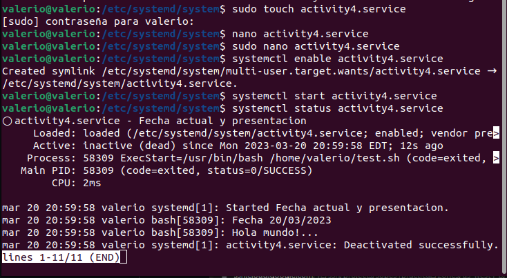

## Para crear un systemd de tipo servicio y ejecutar un script que imprima un saludo con la fecha actual se necesita crear un archivo *.service que se guardara en la carpeta /etc/systemd/system, al ejecutarse este mostrara la el contenido al ejecutar el script.

## En primer lugar hay que crear un archivo de extension .sh el cual contenga la fecha actual y un saludo.
<pre>
#!/usr/bin/bash
echo "Fecha $(date >+'%Y-%m-%d')
echo "Hola mundo!.." </pre>

## Luego se procede a crear el archivo .service en la carpeta antes mensionada /etc/systemd/system, con la siguiente informacion, en donde ExectStart debe estar la ruta completa junto con el archivo del script, en este caso lo ubico en la carpeta /home/valerio/ 

La estructuda del archivo es la siguiente:
<pre>
[Unit]
Description=Fecha actual y presentacion

[Service]
Type=simple
ExecStart=/usr/bin/bash /home/valerio/test.sh

[Install]
WantedBy=multi-user.target</pre>

## Seguido, se debe escribir unos comandos para habilitar y ejecutar el servicio correctamente, los cuales son:

<pre>systemctl enable activity4.service</pre>
<pre>systemctl start activity4.service</pre>
<pre>systemctl status activity4.service</pre>

## El primer comando permite habilitar el servicio, mientras que el segundo es para poder iniciarlo. Finalmente para ver como se ejecuto el servicio y su estado se utiliza el tercer comando.

## Al ejecutar cada uno de estos comando se tendra una salida como la siguiente.

